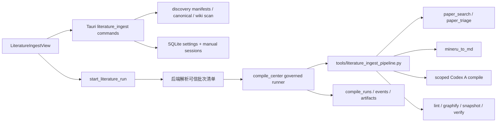

# 客户端文献添加与自动入库：技术设计

## 1. 设计目标

在不建立第二套编译系统的前提下，为现有 Tauri + React 客户端补齐“选择/发现 → 预检 → 确认或资格判断 → 下载/复制 → 解析 → A 编译 → 校验 → 索引/图谱”的产品闭环。候选 manifest 与 Wiki 仍是领域事实来源，SQLite 仅保存客户端设置、临时选择会话和任务审计。

## 2. 现状与约束

- 前端导航和视图装配集中在 `apps/desktop/src/App.tsx`；Tauri 调用封装位于 `apps/desktop/src/services/desktop.ts`，共享 DTO 位于 `apps/desktop/src/types.ts`。
- 编译执行器位于 `apps/desktop/src-tauri/src/compile_center.rs`，提供固定任务允许列表、仓库写锁、SQLite 历史、事件流、取消/暂停/重试/回滚和敏感日志脱敏。
- `tools/paper_search.py`、`tools/paper_triage.py`、`tools/mineru_to_md.py` 与 `tools/full_pipeline.py` 已覆盖底层能力，但缺少按候选/手动批次精确限定的统一入库编排。
- A 编译当前由 Codex CLI 执行；新设计必须把范围限定到本次 canonical 目录，避免“编译所有 pending_ingest”破坏单篇隔离。
- 外部手动 PDF 不在仓库路径边界内，前端不得把任意绝对路径直接传给通用执行器。

## 3. 总体架构



## 4. 模块边界

### 4.1 Python 领域与编排层

新增 `tools/literature_ingest.py`，提供可导入函数和固定 CLI 子命令：

- `candidate-id`：按 DOI → arXiv → 规范化标题生成稳定 ID。
- `migrate-manifests`：为旧 manifest 补齐 `candidate_id`、结构化命中词及默认状态。
- `list-candidates --json`：合并所有 run manifest，以稳定 ID 去重，保留最新元数据和来源 run 列表。
- `qualify --settings ... --json`：返回每个候选的资格结果和逐条原因。
- `stage-manual --manifest ...`：校验可信手动批次文件的 size/mtime/hash 后，复制到 `raw/inbox/manual-drop/<batch>/`。
- `download-candidates --manifest ...`：只下载指定候选并更新 owning manifest/sidecar，不晋升。
- `ingest --manifest ...`：对清单逐篇执行晋升、MinerU、限定范围 A 编译、Lint、Graphify、快照；逐篇落状态，失败继续下一篇。
- `auto-run --settings ...`：先发现和下载，再按资格及上限生成自动正式入库清单。

现有 `paper_search.Paper` 增加向后兼容的 `candidate_id`、`title_matches`、`abstract_matches` 字段；写入 JSON 时保存结构化命中，避免从中文 `score_reasons` 反向解析。旧数据读取时由迁移/聚合函数重新计算或留空并判为“不满足标题命中”。

流水线输出沿用 `PIPELINE_STAGE_START/COMPLETED/FAILED`，并增加：

- `LITERATURE_ITEM_START <candidate-id>`
- `LITERATURE_ITEM_COMPLETED <candidate-id> <source-page?>`
- `LITERATURE_ITEM_FAILED <candidate-id> <stage>`
- `LITERATURE_ITEM_SKIPPED <candidate-id> <reason-code>`

所有命令通过参数数组执行，不拼接 shell 字符串。

### 4.2 Tauri 入库模块

新增 `apps/desktop/src-tauri/src/literature_ingest.rs`：

- 扫描并解析候选 manifest、Wiki source frontmatter、canonical metadata/PDF。
- 提供重复索引：规范化 DOI、arXiv ID、标题和可用 PDF SHA-256。
- 管理设置、启动提示状态和手动选择会话。
- 把前端动作解析为可信的 run manifest，再交给编译执行器。

新增 DTO：

- `LiteratureIngestSettings`
- `LiteratureCapability`
- `CandidateSummary / CandidateDetail`
- `CandidateFilters`
- `DuplicateMatch { kind, value, existing_id, existing_path, title }`
- `ManualImportSession / ManualFilePreflight`
- `StartupPromptState`
- `StartLiteratureRunRequest`

新增命令：

- `get_literature_capabilities`
- `get_literature_settings`
- `save_literature_settings`
- `get_ingest_startup_prompt`
- `suppress_ingest_prompt_today`
- `choose_manual_pdfs`
- `discard_manual_import_session`
- `list_literature_candidates`
- `get_literature_candidate`
- `update_candidate_triage`
- `start_literature_run`

`choose_manual_pdfs` 必须由后端打开多文件选择器，只接受 `.pdf`；选择结果写入 SQLite 临时会话，记录 canonicalized path、size、mtime、SHA-256 和生成时间。前端只得到 session ID 与预检结果。启动任务时后端重新核对这些属性，防止选择后文件被替换。

### 4.3 SQLite

在现有 `knowledge.db` 增加：

```sql
CREATE TABLE literature_ingest_settings (
  repository_path TEXT PRIMARY KEY,
  startup_prompt_enabled INTEGER NOT NULL DEFAULT 1,
  auto_promote_enabled INTEGER NOT NULL DEFAULT 0,
  min_score REAL NOT NULL DEFAULT 8.0,
  max_auto_ingest INTEGER NOT NULL DEFAULT 3,
  providers_json TEXT NOT NULL DEFAULT '[]',
  since_year INTEGER,
  suppressed_prompt_date TEXT NOT NULL DEFAULT '',
  last_attempt_at TEXT NOT NULL DEFAULT '',
  last_success_at TEXT NOT NULL DEFAULT '',
  updated_at TEXT NOT NULL
);

CREATE TABLE manual_import_sessions (
  id TEXT PRIMARY KEY,
  repository_path TEXT NOT NULL,
  files_json TEXT NOT NULL,
  created_at TEXT NOT NULL,
  consumed_at TEXT NOT NULL DEFAULT '',
  status TEXT NOT NULL DEFAULT 'prepared'
);
```

设置按 `repository_path` 隔离，因为当前 SQLite 文件会复用于不同知识库。临时会话消费后保留最小审计摘要，不保存比运行所需更久的外部路径；过期未消费会话在启动时清理。

候选生命周期不复制到 SQLite，继续以 `raw/inbox/auto-discovered/**/results.json` 和 `papers/**/metadata.json` 为权威，避免双写漂移。

### 4.4 编译中心集成

扩展 `compile_center.rs` 的固定任务种类：

- `literature_prepare`
- `literature_manual_ingest`
- `literature_candidate_download`
- `literature_candidate_ingest`
- `literature_auto_ingest`

`start_literature_run` 在 Rust 后端生成 run-specific manifest，保存到应用本地数据目录下的受控运行目录；前端不能提供该路径。内部请求以不可反序列化的可信字段传给 `build_task`，参数日志只保存 mode、candidate IDs、manual session ID、阈值和用户覆盖，不保存 Token 或不必要的外部绝对路径。

编译中心继续负责：

- 一个仓库一个写任务；
- 事件和任务历史；
- 取消、暂停边界和超时；
- Artifact 快照与回滚；
- 日志脱敏；
- 客户端重启后的 interrupted 恢复。

候选/手动页面只展示任务摘要并链接到编译中心详情。

## 5. 数据与状态契约

### 5.1 候选稳定身份

```text
normalized DOI
  else normalized arXiv ID
  else sha256(normalized title)
```

同一候选出现在多个 discovery run 时合并为一个 UI 项，`discoveryRuns[]` 保留全部来源。状态优先级为 `promoted > selected > rejected > pending`，但最新明确人工操作覆盖旧的 pending；冲突需返回诊断字段。

### 5.2 UI 状态

```text
pending
  -> downloaded
  -> selected
  -> staging
  -> parsing
  -> compiling
  -> validating
  -> indexing
  -> promoted

任一运行阶段 -> failed(stage, run_id)
pending/selected/downloaded -> rejected
rejected -> pending
```

底层 manifest 仍使用既有 triage 枚举；运行中细分状态来自 compile events 与 sidecar，不擅自写入不兼容枚举。

### 5.3 自动资格结果

`qualification` 必须是可解释结构：

```ts
type Qualification = {
  eligible: boolean
  score: number
  reasons: { code: string; passed: boolean; message: string }[]
}
```

禁止只返回 `eligible: false`。

## 6. 三条数据流

### 6.1 手动 PDF

1. 后端文件选择器返回临时 session 和预检。
2. UI 默认排除 invalid/oversized/duplicate。
3. 用户确认后，后端重新校验文件指纹并生成可信 manifest。
4. compile runner 建立审计任务并执行逐篇流水线。
5. 成功后刷新仓库索引，UI 提供 source 页；失败项保留 manual inbox 和 run ID。

### 6.2 人工确认候选

1. UI 从所有 manifests 获取合并候选。
2. 用户查看详情、重复和资格原因。
3. “仅下载”运行下载任务，状态仍非正式。
4. “确认添加”把 candidate ID 解析为 owning manifest 项并生成精确清单。
5. 每篇独立晋升与编译；完成后更新 manifest 为 promoted。

### 6.3 自动触发/手动立即运行

1. 仓库就绪后读取 startup prompt state。
2. “今天不再提醒”写本地自然日；“取消”不写；“本次运行”启动 configured mode。
3. 手动按钮绕过 prompt suppression，但使用相同设置。
4. 自动准备只执行 discovery/download。
5. auto promote 开启时，资格器从新候选中按 score/year/title 稳定排序，最多选择配置上限，逐篇正式入库。

## 7. 前端设计

新增目录：

```text
apps/desktop/src/features/ingest/
  LiteratureIngestView.tsx
  LiteratureIngestView.css
  ManualImportTab.tsx
  CandidateReviewTab.tsx
  AutomationTab.tsx
  StartupIngestPrompt.tsx
  ingestState.ts
```

`App.tsx` 增加 `MainView = 'ingest'` 和侧栏项“文献入库”，位于“文献库”与“方法库”之间。仓库未选择时显示选择入口；仓库 generation 变化时清空旧候选/手动 session 并重新加载。

页面布局：

- 顶部：标题、待确认数量、最近运行、刷新。
- 标签区：手动添加 / 待确认 / 自动添加。
- 手动：拖放视觉区仅作文件选择引导；第一版真正输入通过系统选择器，避免 WebView 路径权限不一致。
- 待确认：左侧列表 + 右侧详情，批量动作固定在列表上方。
- 自动：模式卡、启动询问、来源/阈值/上限、资格预览、立即运行、最近任务。

启动提示使用应用内可访问 modal，不调用阻塞式 `window.confirm`。焦点锁定、Escape=取消、按钮顺序和 aria 标签完整。

纯状态逻辑放入 `ingestState.ts`，覆盖日期抑制、候选排序/筛选、批量选择、资格展示和事件归并，避免在大组件里堆叠不可测试分支。

## 8. 依赖与降级

`LiteratureCapability` 分阶段返回：

- discovery：Python + paper_search + 至少一个可用 provider；
- download：网络 + PDF URL；
- parse：Python + MinerU tool + Key；
- compile：Codex CLI；
- graph：Graphify；
- full ingest：以上全部 + lint/snapshot 工具。

UI 按动作依赖禁用，而不是整页不可用。自动准备不依赖 Codex/Graphify；仅下载不依赖 MinerU。

## 9. 安全、边界与隐私

- 只有后端文件选择器生成的 session 可引用仓库外文件。
- 外部路径在执行前再次 canonicalize；拒绝目录、非 PDF、空文件、超 200MB、符号链接/重解析点异常和指纹变化。
- 下载继续复用大小上限、超时和 Content-Type/PDF 头检查。
- run manifest 位于应用本地受控目录，候选路径必须解析到当前仓库已知 manifest。
- 日志继续脱敏 Key、Bearer、签名 URL；候选摘要不得记录凭据。
- 自动 A 编译提示限定本次 canonical 路径，并保留现有禁止项。

## 10. 失败、恢复与回滚

- 单篇状态在 sidecar/manifest 中先写 running stage，成功后才写 promoted。
- 某篇失败时写 `failed_stage`、`failure_reason`、`compile_run_id`；批次继续下一篇，最终任务可为 succeeded-with-item-failures 或 failed，结果 JSON 给出计数。
- 重试从可验证的最近安全阶段开始：已有合法 PDF 不重下，已有完整 `full.md` 不重解析，已有 source 且 lint 通过不重复编译。
- 取消在篇间和既有 full pipeline stage boundary 生效。
- 回滚使用 compile center artifact 清单；raw PDF/Raw 正文仍遵循现有保守回滚边界，UI 明确显示不可自动回滚项。

## 11. 兼容与迁移

- SQLite 使用 `CREATE TABLE IF NOT EXISTS` 和幂等列/索引迁移。
- 旧 manifest 字段缺失全部用默认值读取；首次写操作前原子备份并补齐字段。
- 根 PRD 更新为：自动发现默认只进 inbox；只有用户显式开启且资格器通过时才允许自动晋升，B 类和 schema 边界不变。
- 不改变现有 `discover/parse/full_pipeline` 行为，新增入口通过新任务种类接入，降低回归风险。

## 12. 取舍

- 不把候选复制到 SQLite：读取 JSON 稍慢，但保持单一真相并避免双写。
- 不安装后台服务：符合用户决定，启动提示和手动按钮足够。
- 新增专用入库编排器而不是继续扩张通用 `full_pipeline.py`：可精确限定候选、单篇隔离和迁移旧 manifest，同时保留旧流水线兼容。
- 单一跨层任务实施：RPC、manifest、状态机和 UI 强耦合；按阶段提交前检查替代 Trellis 子任务拆分。

## 13. 发布与回滚策略

- 功能默认关闭 auto promote，升级后只出现启动询问和自动准备能力。
- 若新增入口出现问题，可隐藏 `ingest` 导航并保留既有编译中心；新增 SQLite 表和 manifest 字段均向后兼容。
- 发布前构建新版本并执行严格 GUI 冒烟；版本号在实施时按现有发布规则提升。
