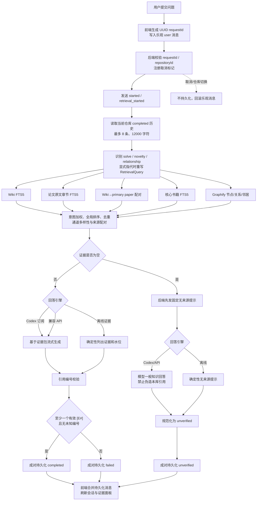

# 智能问答功能审查报告（桌面端 0.12.3）

> **修复状态（2026-08-12）**：子任务 `.trellis/tasks/08-12-qa-p1-p2-remediation` 已实现本报告第 6 节全部 P1/P2 项：canonical intent/method 保底、claim-level 引用覆盖与 graph-only 门禁、未知中文检索词、通道归一化/RRF/相似去重、精确历史来源 ID、兼容 API 完整终止校验、可信度 UI、零证据空态以及 Markdown/GFM/KaTeX。第 6–7 节保留为审查基线；当前剩余项为 P3 性能与会话分页，以及尚未实现的语义蕴含自动核验。

## 1. 审查结论

当前智能问答已经具备一条完整、可恢复、可取消、按知识库隔离的 RAG 业务链路。它的核心不是“让模型自由阅读整个仓库”，而是：

> **本地多通道关键词检索 + 规则排序与证据组包 + 受 `[E#]` 编号约束的模型生成 + 终态持久化。**

0.12.3 已经解决上一轮最关键的五类可靠性问题：历史感知查询、零证据 `unverified`、即时请求 ID 与取消、失败问答成对持久化、Graphify 关系/邻居召回。因此这些能力不再列为缺陷。

当前最需要优先处理的两个问题是：

1. **`solve` 意图的 method 保底分支存在字符串错误**：意图函数输出 `solve`，保底逻辑却匹配 `solution`，导致“解决办法”问题可能没有 method 页进入最终证据包。
2. **`supported` 只代表“至少引用了一个存在的编号”**，不代表每条事实都有引用，更不代表引文语义上支持该事实。对科研问答而言，这会让可信度标签强于实际证明能力。

## 2. 当前库水位与审查证据边界

- source：23（21 篇论文/预印本 + 2 本核心专著）
- method / concept：20 / 7
- synthesis：7
- system-model / objective / dataset-or-sim：4 / 4 / 1
- 核心书籍章节：61，PDF 页数 1171
- 固定问答回归：10（5 solve、3 novelty、2 relationship）
- 内容年份：2017–2026

来源：

- `E:/知识库/wireless_charging/wiki/maps/library-status.md:1`
- `E:/知识库/wireless_charging/wiki/index.md:1`

本轮验证结果：

| 验证 | 结果 | 能证明什么 |
|---|---:|---|
| `npm run test:p1` | 13/13 通过 | 前端完成幂等、重试绑定、失败交换合并、乐观消息回滚等纯状态逻辑 |
| `cargo test qa::tests --lib` | 16/16 通过 | 历史边界、引用编号、零证据、失败持久化、Graphify 映射等后端单元契约 |
| Gold retrieval test | 1/1 通过，覆盖 10 个问题 | 每个固定问题能同时召回预期 Wiki 和带原文行号的 paper 证据 |
| `wiki_eval.py --answers-dir` | 10/10 通过 | 基线答案具有预期链接、库水位和必提概念 |
| 核心书籍检索报告 | 1.000000 / 0.986667 Recall@5 | 两本书的章节种子查询召回能力 |

Gold test 的实际断言见 `E:/知识库/wireless_charging/apps/desktop/src-tauri/src/lib.rs:4176-4242`；确定性评测的边界也在 `E:/知识库/wireless_charging/evals/README.md:1` 明确说明。

这些测试**尚未证明**：真实 Codex/兼容 API 回答的事实准确率、逐 claim 引用覆盖率、引文蕴含关系、幻觉率、真实流式协议兼容性、P95 延迟、并发压力和长会话体验。

## 3. 端到端业务逻辑

### 3.1 交互与请求身份

- 前端在调用 Tauri 前生成 UUID，并立即保存为活动请求，所以停止按钮不需要等待后端回传：`E:/知识库/wireless_charging/apps/desktop/src/features/qa/AskView.tsx:216-240`。
- 流事件和 invoke promise 都可能交付完成结果，`claimCompletion` 用 request ID 去重，避免重复落 UI：`E:/知识库/wireless_charging/apps/desktop/src/features/qa/completionState.ts:12-31`。
- 切换仓库时递增 generation、取消旧请求并清空视图；后端也在生成与持久化前复核 repository ID：`E:/知识库/wireless_charging/apps/desktop/src/features/qa/AskView.tsx:105-115`、`E:/知识库/wireless_charging/apps/desktop/src-tauri/src/lib.rs:2856-2865`、`E:/知识库/wireless_charging/apps/desktop/src-tauri/src/lib.rs:3029-3064`。

### 3.2 历史与查询重写

- 只有 `completed` 的 user/assistant 消息可进入历史；上限是 8 条、12000 字符：`E:/知识库/wireless_charging/apps/desktop/src-tauri/src/qa.rs:742-795`。
- 仅当当前问题含“它们、二者、上述、they、both”等显式指代时，才从近期历史提取大写模型名和已索引页面实体：`E:/知识库/wireless_charging/apps/desktop/src-tauri/src/qa.rs:798-925`。
- 历史只用于消解当前检索词；旧 `[E#]` 不会被复用为当前证据。

### 3.3 多通道检索与排序

- Wiki、paper、linked paper、book、Graphify 五路候选依次召回，并在通道之间检查取消：`E:/知识库/wireless_charging/apps/desktop/src-tauri/src/qa.rs:1704-1731`。
- 意图目前只有 `solve / novelty / relationship` 三类，并通过固定 bonus 调整候选：`E:/知识库/wireless_charging/apps/desktop/src-tauri/src/qa.rs:1049-1088`。
- 排序后按资源 ID 去重，并强制保留一定通道多样性；paper 证据尽量与其 Wiki source 配对：`E:/知识库/wireless_charging/apps/desktop/src-tauri/src/qa.rs:1732-1855`。
- Graphify 会检索节点描述、关系和一跳邻居，但只有能映射到实际 `wiki/**/*.md` 且已进入 pages 表的中心节点才可返回；它始终只是 `graph_hint`：`E:/知识库/wireless_charging/apps/desktop/src-tauri/src/qa.rs:1492-1580`。

### 3.4 三种回答引擎与零证据

1. **Codex 订阅**：仅选择该 provider 时探测登录状态，30 秒缓存；在 blocking worker 中流式回答。
2. **兼容 API**：用 endpoint、环境变量 API key、model、temperature、max tokens 发起 OpenAI 风格 SSE 请求；同样在 blocking worker 中运行。
3. **离线证据**：不调用模型，确定性输出库水位、证据摘要和可定位来源。

provider 分支位于 `E:/知识库/wireless_charging/apps/desktop/src-tauri/src/lib.rs:2874-2983`。

零证据时，后端先发送固定提示，Codex/API 可以继续给出模型一般知识答案，但最终强制规范化为 `unverified`；离线引擎只输出确定性提示：`E:/知识库/wireless_charging/apps/desktop/src-tauri/src/lib.rs:2911-2917`、`E:/知识库/wireless_charging/apps/desktop/src-tauri/src/qa.rs:1954-2011`。

### 3.5 引用校验与持久化

- 当前校验器扫描 `[E数字]`，检查编号是否属于本轮 evidence；有证据时只要求“至少一个有效编号且没有未知编号”：`E:/知识库/wireless_charging/apps/desktop/src-tauri/src/qa.rs:1896-1952`。
- 校验通过后，user 与 assistant 在同一事务成对保存，并保存 evidence、水位和 citationValidation：`E:/知识库/wireless_charging/apps/desktop/src-tauri/src/qa.rs:2222-2359`。
- provider/retrieval/引用失败也会保存成对的 failed exchange，确保问题可见、可重试：`E:/知识库/wireless_charging/apps/desktop/src-tauri/src/qa.rs:2363-2415`。

## 4. 四类终态

| 终态 | 触发条件 | 是否持久化 | 是否进入后续历史 | 是否可重试 |
|---|---|---:|---:|---:|
| `completed` | 有证据，至少一个有效引用且无未知引用 | user + assistant 成对 | 是 | 是 |
| `unverified` | 零证据；固定提示 + 模型一般知识或离线提示 | user + assistant 成对 | 否 | 是 |
| `failed` | 检索、provider、持久化或引用校验失败 | 通常成对保存失败交换 | 否 | 是 |
| `cancelled` | 用户停止或取消 tombstone 生效 | 否 | 否 | 重新提交原问题 |

仓库切换与 `cancelled` 一样不会保存旧回答。历史查询明确只接受 `status='completed'`，见 `E:/知识库/wireless_charging/apps/desktop/src-tauri/src/qa.rs:760-765`。

## 5. 当前已经做好的能力

1. **请求身份完整**：客户端 UUID、重复活动 ID 拒绝、完成事件幂等。
2. **取消链路前移**：开始检索前就可停止；早到的 cancel 用短期 tombstone 保留。
3. **仓库隔离**：会话、检索快照、生成完成和最终写入都核对 repository。
4. **阻塞任务隔离**：SQLite/FTS、Graphify、Codex 和兼容 API 均不直接阻塞 async command executor。
5. **历史污染控制**：失败、取消、无证据答案不进入下一轮上下文。
6. **零证据诚实标记**：服务端拥有固定提示，模型不能省略；伪造的 `[E#]` 会转成“无来源”。
7. **失败可恢复**：首轮失败也会建立可打开的会话，问题与错误成对保存并支持重试。
8. **来源可定位**：Wiki、论文原文行号、书籍 physical page、Graphify 对应页面均可回跳。
9. **Graphify 不越权**：图关系只作提示，不单独支撑事实。
10. **密钥边界清晰**：API key 只从环境变量读取，不写入普通设置和会话记录。

## 6. 当前缺点与优化点

### P1-1：`solve` 的 method 保底逻辑没有生效（明确缺陷）

- **证据**：意图函数默认返回 `solve`，但 method 保底分支匹配的是 `solution | novelty`：`E:/知识库/wireless_charging/apps/desktop/src-tauri/src/qa.rs:1049-1057`、`E:/知识库/wireless_charging/apps/desktop/src-tauri/src/qa.rs:1776-1793`。
- **影响**：用户问“有什么解决办法”时，即使已召回 method，最终 top-N 也可能被 paper/source 占满，缺少可直接执行的方法页。
- **触发**：solve 问题、候选中有 method、method 排名落在截断线后。
- **当前保护**：solve 有 method/paper 意图加权，且会保留 Wiki/paper/book 多样性；但没有 method 的最终硬保证。
- **建议**：把 `solution` 改为 `solve`，新增“solve 候选存在 method 时最终 evidence 必含 method”的回归。
- **收益/复杂度**：高 / 低。

### P1-2：`supported` 标签强于实际引用证明能力（能力边界，业务风险）

- **证据**：校验器只验证引用编号存在、至少引用一次；没有分句、claim coverage、来源类型约束或语义蕴含判断：`E:/知识库/wireless_charging/apps/desktop/src-tauri/src/qa.rs:1896-1952`。
- **影响**：回答可以包含十条事实但只在末尾引用一个 `[E1]`，仍被标记 `supported`；引用内容与事实不相关也会通过。
- **触发**：模型漏引、错引、把 Graphify 提示当事实、一个引用覆盖多个不相干结论。
- **当前保护**：prompt 要求“每个事实判断必须引用”，未知编号会失败，Graphify 被声明为不可单独支撑事实。
- **建议**：先做确定性的“事实句—引用覆盖率 + graph-only 禁止”门禁，再增加轻量 NLI/LLM judge 做 claim-evidence entailment；将状态拆成 `syntax_valid / coverage_valid / entailment_checked`，避免一个 `supported` 混合多个含义。
- **收益/复杂度**：极高 / 中到高。

### P2-1：检索意图和 query expansion 依赖硬编码规则（能力边界）

- **证据**：意图只有三个字符串包含判断；词项扩展也是手写双语映射：`E:/知识库/wireless_charging/apps/desktop/src-tauri/src/qa.rs:935-1057`。
- **影响**：同义表达、缩写、低频术语、组合问题、约束/目标/数据集类问题容易误分类或漏召回；规则会随知识库增长产生维护成本。
- **当前保护**：FTS prefix OR、领域词扩展、意图 bonus、来源多样性。
- **建议**：保留 FTS 作为可解释基线，增加本地 embedding 召回；用小型结构化分类器输出多标签 intent、实体、约束、目标，再做 reciprocal rank fusion。
- **收益/复杂度**：高 / 中。

### P2-2：异构通道分数直接混排，且强制通道多样性可能稀释相关性（能力边界）

- **证据**：各通道分别构造自己的 BM25/规则分数，随后直接全局排序；缺失 required kind 时会弹出末项并强插该通道候选：`E:/知识库/wireless_charging/apps/desktop/src-tauri/src/qa.rs:1092-1342`、`E:/知识库/wireless_charging/apps/desktop/src-tauri/src/qa.rs:1732-1775`。
- **影响**：不同通道的数值尺度不可直接比较；某通道只要有低相关结果也可能被强制加入，挤掉更相关证据。
- **当前保护**：意图 bonus、精确 ID 去重、paper/Wiki provenance 配对。
- **建议**：通道内 rank 标准化 + RRF；加入最低相关阈值；最终用 cross-encoder/LLM reranker，并用 MMR 控制重复章节。
- **收益/复杂度**：高 / 中。

### P2-3：多轮指代只覆盖显式触发词，审计 ID 也不精确（能力边界/可观测性问题）

- **证据**：只有固定指代词才提取实体；`usedHistoryMessageIds` 在提取到任意实体时直接记录最近 4 条，而不是实际贡献实体的消息：`E:/知识库/wireless_charging/apps/desktop/src-tauri/src/qa.rs:798-925`。
- **影响**：“那 GAIN 呢”“继续比较约束”“前面第二个方法”之类省略问句可能不重写；调试时无法准确解释实体来自哪一条历史。
- **当前保护**：历史严格限长、只取 completed、不复用旧引用。
- **建议**：实体抽取返回 `(entity, sourceMessageId)`；增加中文省略问句、别名、大小写不敏感模型名；在 UI 开发模式展示 resolved query。
- **收益/复杂度**：中 / 中。

### P2-4：兼容 API 的 SSE 容错会静默吞掉协议错误和截断信号（明确风险）

- **证据**：无法解析的 SSE 行直接 `continue`，只拼接 content；没有核对 `finish_reason`、usage 或是否真正收到 `[DONE]`：`E:/知识库/wireless_charging/apps/desktop/src-tauri/src/qa.rs:2152-2187`。
- **影响**：供应商格式轻微不兼容或输出达到 token 上限时，可能把半截回答当完整回答持久化；只要半截里存在一个有效引用，就可能成为 `completed`。
- **当前保护**：HTTP 状态检查、总超时、空回答失败、取消检查。
- **建议**：记录但不泄密地报告协议解析错误；要求合法终止事件；识别 `finish_reason=length/error`，转为可重试 failed 或显式 truncated 状态；增加 mock SSE chaos tests。
- **收益/复杂度**：高 / 中。

### P2-5：可信度信息已经保存，但 UI 没有展示（体验缺陷）

- **证据**：assistant message 持有 `citationValidation`，但消息区只显示 `failed/unverified/time`，没有展示 supported、引用精度或未知编号：`E:/知识库/wireless_charging/apps/desktop/src/features/qa/AskView.tsx:56-75`、`E:/知识库/wireless_charging/apps/desktop/src/features/qa/AskView.tsx:305-315`。
- **影响**：用户看不到“机器只做了编号校验”的边界，也无法区分引用状态；后端的可信度数据没有转化成用户决策信息。
- **当前保护**：引用按钮可打开 evidence；unverified 文案明显。
- **建议**：增加“引用编号已校验 / 语义未核验”的状态条，显示已引用数、证据总数、coverage；点击可跳到 claim—evidence 对照。
- **收益/复杂度**：高 / 低到中。

### P2-6：零证据完成后，右侧仍显示“等待检索”（明确 UI 缺陷）

- **证据**：只要 `evidence.length===0` 就固定显示“等待检索”，没有根据 phase/终态区分：`E:/知识库/wireless_charging/apps/desktop/src/features/qa/AskView.tsx:318-323`。
- **影响**：回答已经结束并被标记 `unverified`，证据面板却暗示检索仍未发生，状态语义冲突。
- **建议**：idle + waterline + 0 evidence 显示“本轮未检索到参考来源”；retrieving 才显示“等待检索”。
- **收益/复杂度**：中 / 低。

### P2-7：科研回答仅按纯文本渲染（体验能力缺口）

- **证据**：`MessageContent` 只切分 `[E#]`，其余内容原样放入 span：`E:/知识库/wireless_charging/apps/desktop/src/features/qa/AskView.tsx:68-75`。
- **影响**：Markdown 标题、列表、代码块、表格、公式无法结构化显示，复杂模型和约束对比可读性差。
- **建议**：使用受控 Markdown renderer，支持 GFM table、代码块和 KaTeX；保留自定义 citation node，禁用危险 HTML。
- **收益/复杂度**：中高 / 中。

### P3-1：Graphify 搜索与取消粒度在大图上会退化（性能扩展项）

- **证据**：每次查询遍历全部图节点，并对每个可映射节点执行一次 pages 查询；取消只在整个 Graphify 通道前后检查：`E:/知识库/wireless_charging/apps/desktop/src-tauri/src/qa.rs:1473-1524`、`E:/知识库/wireless_charging/apps/desktop/src-tauri/src/qa.rs:1704-1731`。
- **影响**：当前小库可接受；图规模增大后会形成 O(nodes) 扫描 + N+1 SQLite，停止操作也要等单个通道返回。
- **当前保护**：graph JSON 按 path/length/mtime 缓存解析结果；整个检索在 blocking worker。
- **建议**：缓存时预先解析 page ID/title，构建倒排索引；扫描内部周期检查 cancel；记录各通道耗时和候选数。
- **收益/复杂度**：中 / 中。

### P3-2：会话搜索只覆盖最近 100 条（产品扩展项）

- **证据**：服务默认请求 100 条，前端只在已加载数组中本地过滤：`E:/知识库/wireless_charging/apps/desktop/src/services/desktop.ts:104-109`、`E:/知识库/wireless_charging/apps/desktop/src/features/qa/AskView.tsx:284-288`。
- **影响**：长期使用后，旧会话即使标题匹配也搜索不到。
- **建议**：后端分页与 FTS/LIKE 搜索，前端无限滚动；会话列表返回命中片段。
- **收益/复杂度**：中低 / 低到中。

## 7. 推荐优化路线

### 第一阶段：0.12.4 可信度与确定性修复（推荐下一批 MVP）

| 项目 | 优先级 | 复杂度 | 验收口径 |
|---|---:|---:|---|
| 修复 `solve`/`solution` 字符串并补回归 | P1 | 低 | solve 有 method 候选时最终 evidence 必含 method |
| 增加 claim 引用覆盖率门禁 | P1 | 中 | 每个事实句至少有可用引用；graph-only 不得支撑事实 |
| UI 展示引用校验边界和零证据正确空态 | P1/P2 | 低 | 用户可见“编号已校验、语义未核验”；零证据不再显示等待检索 |
| 兼容 API 合法终止与截断检测 | P1/P2 | 中 | malformed SSE、无 DONE、finish_reason=length 均有确定终态和测试 |

这是最小且收益最高的一批：先让“解决办法召回”和“可信度标签”与真实行为一致，再扩展更复杂的检索模型。

### 第二阶段：0.13 混合检索与可评测性

1. FTS + 本地 embedding 双路召回。
2. 通道内归一化/RRF，最低相关阈值，cross-encoder rerank，MMR 去重。
3. 扩展多标签意图、实体别名和省略问句解析。
4. 建立 answer-level eval：claim coverage、citation entailment、unsupported claim rate、answer completeness。
5. 建立 provider mock/chaos 测试：超时、断流、限长、格式差异、取消竞态。

### 第三阶段：0.14 体验、性能与运维

1. Markdown/GFM/KaTeX 与 claim—evidence 对照视图。
2. Graphify 倒排索引、批量 page 映射、通道内可取消。
3. 会话后端分页与全文搜索。
4. 记录不含问题正文/密钥的指标：各通道 P50/P95、零证据率、provider 失败率、引用门禁失败率、取消响应时间。

## 8. 最终判断

当前版本已经从“能回答”升级到“有明确状态机、证据包和恢复路径的本地科研问答”。它的主要优势是数据本地、来源可定位、零证据不冒充有证据、失败和取消语义清晰。

它目前还不是严格意义上的“事实级可验证科研助手”：检索仍以词法规则为主，`supported` 仍是编号语法级而非 claim 语义级，真实模型输出质量没有自动化闭环。下一步应优先修复 `solve` method 保底和可信度门禁，而不是先增加更多 provider 或更复杂的界面功能。
