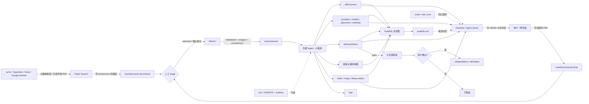
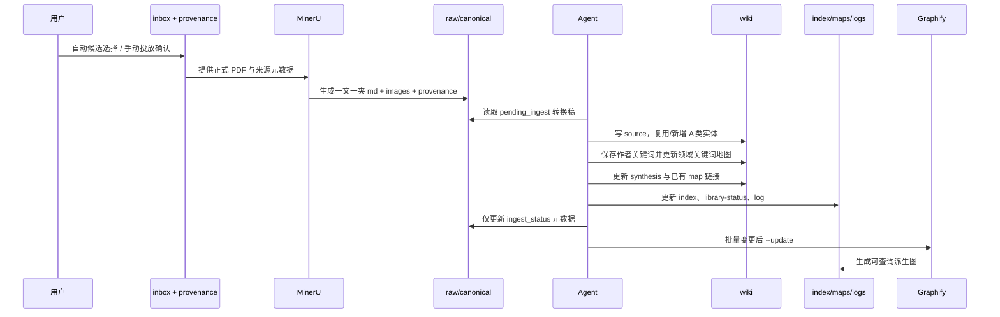

# 架构文档 · 无线充电调度 LLM Wiki

本文描述当前 vault 的系统边界、权威层级、目录职责、核心数据契约与运行流程。它回答“系统如何工作”；产品决策仍以 [[prd]] 为最高权威，Agent 的可执行约束以 [[AGENTS]] 与 `schema/` 为准。

## 1. 架构摘要

本项目不是传统应用，也不是“每次对 PDF 做一次临时 RAG”的问答目录。它是一个**规范驱动的科研知识编译系统**：

1. arXiv / OpenAlex / Tavily / Google Scholar 生成带时间戳的 `raw/inbox/auto-discovered` 候选；手动文献进入 `raw/inbox/manual-drop`；
2. 正式文献经 MinerU 转成 Markdown，保存在只读 `raw/` 层；
3. Agent 按 schema 将文献增量编译为可交叉引用的 `wiki/`；
4. Obsidian、Claudian 与 Agent 从 `wiki/` 查询，答案必须受 [[wiki/maps/library-status|库水位]] 约束；
5. 作者关键词经 source 原词、领域关键词地图和受控词表提案三层治理，持续扩展领域导航；
6. Graphify / CodeGraph 提供可重建的定位与关系导航，但不取代 wiki 正文；
7. `evals/` 用固定问题检查 Query 是否仍带正确 wikilink、方法边界与库水位；
8. `problem` / `idea` 属于 B 阶段，只有用户确认后才能写入。

当前已编译库水位：**23 篇 source（21篇论文/预印本 + 2本核心专著）、7 篇 synthesis，年份 2017–2026，上次 ingest 为 2026-08-01**。20/21篇论文source有作者Keywords / Index Terms，共90次关键词出现。自动发现累计为46条pending、6条selected、14条rejected、12条promoted；12篇promoted已完成MinerU和A编译。当前实体规模为23个source、7个concept、20个method、7个synthesis、1个正式problem，并有10份问答回归答案；详见 [[wiki/index|Wiki 索引]] 与 [[wiki/maps/library-status|库水位]]。

## 2. 核心架构原则

### 2.1 编译优先，而非临时重推

知识首先被编译成稳定页面和链接，再用于问答。新增文献的价值体现为 `wiki/` 变厚、索引与综合关系变好，而不是只在 `raw/` 中多一个 PDF。

### 2.2 正文与派生索引分离

| 类别 | 位置 | 性质 |
|------|------|------|
| 原始证据 | `raw/canonical/` | 正式文献转换稿；正文只读 |
| 持久知识正文 | `wiki/` | 问答与综合的主要事实层 |
| 规则与契约 | `schema/`、`AGENTS.md`、`prd.md` | 约束 Agent 如何读写知识 |
| 导航与簿记 | `wiki/index.md`、`wiki/maps/`、`logs/` | 内容入口、库水位和变更审计 |
| 派生图与工具索引 | `graphify-out/`、`.codegraph/` | 可重建；不得冒充正文真相 |

回答争议性事实时应回到 source 页及其 `raw_md` / `pdf_path`；不能用 Graphify 社区、节点中心性或推断边替代文献证据。

### 2.3 A 主链与 B 闸门

- **A 类编译**：`source`、`concept`、`system-model`、`objective`、`method`、`dataset-or-sim`、`synthesis`。Agent 可按规则自动写入。
- **B 类研究锻造**：`problem`、`idea`。允许先在对话中起草，只有用户确认后才能写入，且必须链回 source / synthesis / gap。
- A 类页面只忠实整理、并列主张和标记 gap，不写“我们的贡献”或用户 idea。

### 2.4 水位限定与并存不裁断

- `/solve` 与 `/novelty` 都必须先声明当前库水位。
- “库内未见”不能升级为“全球没有”或“必然新颖”。
- 文献冲突按各自设定并列，系统不替用户选边。
- 通用外搜与 `/novelty` 实时查新默认需用户批准；已配置的 Paper Search 可周期写入 inbox，但不能自动晋升或形成 wiki 事实。

## 3. 逻辑架构



这里有两条不同的控制链：

- **数据链**：`raw → wiki → query`；
- **治理链**：`prd / AGENTS / schema → Agent 行为与页面契约`。

Graphify 位于数据链旁路，只负责缩小候选范围和展示关系。

## 4. 权威层级与写权限

### 4.1 决策优先级

发生冲突时按以下顺序处理：

1. `prd.md`：产品目标、边界与已锁定决策；
2. `AGENTS.md` + `schema/`：Agent 可执行规则；
3. `wiki/` 正文：已编译知识；
4. `raw/canonical/`：事实溯源和争议复核；
5. `wiki/index.md`、maps、logs：导航与状态快照；
6. `graphify-out/`、`.codegraph/`：派生定位结果。

导航文件若与真实正文不一致，应修导航；Graphify 若与 wiki 不一致，以 wiki 正文为准；wiki 的具体 claim 若与原文有争议，应回到 raw/PDF 复核。

### 4.2 写权限矩阵

| 区域 | 默认权限 | 允许的变化 |
|------|----------|------------|
| `raw/` | 正文只读 | 仅 frontmatter 状态等元数据 |
| `wiki/` A 类 | 可写 | 新增/更新结构化知识与链接 |
| `wiki/problems/`、`wiki/ideas/` | 闸门写 | 仅用户明确确认后写入 |
| `wiki/maps/` | 受控写 | 已有 map 可补链；新主题 map 要确认 |
| `schema/`、`AGENTS.md`、`prd.md` | 默认只读 | 词表缺口只写 `vocab-proposals.md`；原则变更需用户决策 |
| `logs/` | 追加写 | 保留 append-only 时间线与运行详情 |
| `graphify-out/` | CLI 生成 | 不手工维护正文知识 |

## 5. 目录与组件职责

| 路径 | 组件职责 | 主要输入 | 主要输出 / 消费者 |
|------|----------|----------|-------------------|
| `HOME.md` | 人类总入口 | 手工导航 | Obsidian 用户 |
| `使用说明.md` | 日常操作手册 | 已定流程 | 用户与新 Agent |
| `raw/inbox/auto-discovered/runs/` | 自动检索审计快照 | 四源自动发现 | Paper Triage；不进入 Graphify |
| `raw/inbox/auto-discovered/papers/` | 已选自动候选 | Paper Triage 元数据、可选 PDF | 人工晋升 / MinerU |
| `raw/inbox/manual-drop/` | 手动投放区 | 用户 PDF | 人工确认 / MinerU |
| `raw/canonical/` | 正式源材料 | PDF、MinerU md、images | A 编译与溯源 |
| `wiki/sources/` | 单篇文献卡 | canonical md | Query、实体页、synthesis |
| `wiki/concepts/` | 中英术语与概念 | 多个 source | Query、maps |
| `wiki/system-models/` | 场景、实体、假设 | source | Query、objective/method |
| `wiki/objectives/` | 目标与约束族 | source | 方法匹配 |
| `wiki/methods/` | 方法/算法骨架 | source | `/solve` 核心候选 |
| `wiki/datasets-sims/` | 数据与仿真协议 | source | 可复现性查询 |
| `wiki/syntheses/` | 多源并列对照与 gaps | sources / entities | Query 与 B 阶段输入 |
| `wiki/problems/`、`wiki/ideas/` | 用户确认的研究问题与候选思路 | synthesis gaps / 用户假说 | B 阶段与 novelty 检查 |
| `wiki/maps/` | 主题 MOC 与库水位 | wiki 链接、计数 | 人类导航、Query 前置 |
| `wiki/index.md` | Karpathy 式内容目录 | 全部 wiki 页面 | 首要查询入口 |
| `schema/` | 页面类型、frontmatter、词表、流程 | PRD 决策 | Agent / Claudian 约束 |
| `templates/` | 新页面骨架 | schema | 人工或 Agent 新建页 |
| `logs/` | 时间线和可审计变更 | Ingest / Lint / note | 维护者 |
| `evals/` | 固定问题、预期链接与答案契约 | 当前核心 source/synthesis | Query 回归验收 |
| `tools/wiki_eval.py` | 确定性评测校验 | `evals/gold_questions.json`、可选答案目录 | CI/人工验收 |
| `tools/domain_keywords.py` | 只读检查论文关键词字段与地图覆盖 | source frontmatter、领域关键词地图 | Ingest / Lint 验收 |
| `graphify-out/` | 图 JSON、HTML、报告与查询记忆 | 被纳入图的 Markdown | Agent / 终端图查询 |
| `.agents/`、`.codex/`、`.claude/` | 不同 Agent 平台的 skill 注册 | Graphify 安装 | 工具运行时，不是领域知识 |
| `.codegraph/` | CodeGraph 索引 | 当前目录内容 | 代码/符号定位；不作为事实源 |

当前尚未实例化的 A 类目录（如 `system-models`、`objectives`、`datasets-sims`）是**允许为空的扩展槽位**，不代表 schema 缺失。

## 6. 数据模型与链接契约

### 6.1 页面类型

系统只定义 9 种 wiki 正文类型。目录、文件前缀和阶段由 `schema/page-types.md` 固定：

| 阶段 | type | 前缀 | 关键关系 |
|------|------|------|----------|
| A | `source` | `src-` | 指向 raw、concept、method、synthesis |
| A | `concept` | `cpt-` | 由一个或多个 source 定义 |
| A | `system-model` | `sys-` | 描述 scenario、entities、假设 |
| A | `objective` | `obj-` | 描述 objectives 与 constraints |
| A | `method` | `mtd-` | 指回来源 source |
| A | `dataset-or-sim` | `data-` | 指回评测来源 |
| A | `synthesis` | `syn-` | `covers` 多个 source，产生 gaps |
| B | `problem` | `prob-` | `inspired_by` 至少一个来源锚点 |
| B | `idea` | `idea-` | `user_confirmed: true` 后才正式存在 |

`map` 是导航页面，不属于上述 9 类知识实体。

### 6.2 Frontmatter 契约

- 所有 wiki 页面至少包含 `type`、`title`、`status`；知识页通常还含 `epistemic` 与 `updated`。
- source 额外保留 `acquisition_method`、`discovered_via`、`discovery_run`、`triage_status`、`selected_by_user`、`acquired_at`、`canonicalized_at` 与 `ingest_status`。
- `manual_upload/auto_discovery` 是采集来源；`pending/selected/rejected/promoted` 是筛选状态；`pending_convert/pending_ingest/ingested/convert_failed` 是编译状态。三个维度不得混用。
- source 额外保存 `year`、`venue`、可选 `doi`、`source_type`、`pdf_path`、`raw_md`、`ingest_status`。
- source 的 `paper_keywords` 保存作者原词，`keyword_source` 保存 `author_keywords | index_terms | not_found`；二者是自由元数据，不使用受控 id。
- method 用 `subtype: method | algorithm` 区分方法与具体算法。
- problem / idea 必须有来源锚点，并受 `user_confirmed` 闸门控制。
- `scenario`、`entities`、`constraints`、`objectives`、`method_family`、`problem_class` 只能使用 `schema/vocab.yaml` 中已有 id。
- 缺少受控词时写入 `schema/vocab-proposals.md`，不能直接扩展正式词表。
- 论文关键词先进入 [[wiki/maps/map-domain-keywords|领域关键词地图]]；只有匹配字段确有表达缺口时才形成 vocab proposal。

### 6.3 最小可追溯链

```text
raw Markdown / PDF
  ← source.pdf_path / source.raw_md
source
  ↔ concept / method / system-model / objective
source 集合
  ← synthesis.covers
synthesis gap
  → problem / idea.inspired_by（仅用户确认后）

source.paper_keywords
  → map-domain-keywords（规范别名 + source 证据）
  → vocab-proposals（必要时，仍需用户确认）
```

一个 source 页若有可抽取内容，验收时至少应链接到一个 method、concept 或 system-model；方法页必须指回来源 source。

页面实例化还受准入规则约束：source 默认一文一页；concept/method 原则上至少被 2 个 source 复用，或确属真实问答需要的核心锚点；synthesis 至少覆盖 2 个 source 并提供对照与 gap。空目录不是待填表格。

## 7. 核心运行流程

### 7.0 Discover：论文自动发现

```text
主题预设 / 自定义 query
  → arXiv + 已配置的 OpenAlex / Tavily / Google Scholar（SerpApi）
  → 元数据归一化、DOI/arXiv ID/标题去重、透明启发式排序
  → raw/inbox/auto-discovered/runs/search-*/{README.md, results.json}
  → paper-triage：pending → selected | rejected
  → selected 元数据/可选 PDF 进入 auto-discovered/papers/
  → 人工确认后由 MinerU 输出到 raw/canonical，并传播 provenance
```

发现层的停止线是 `raw/inbox`：结果必须带 `retrieved_at`、`acquisition_method`、来源列表、运行路径和候选边界，不自动调用 MinerU、不写 wiki、不更新 Graphify。`--new-only` 可对比历史报告支持周期运行；PDF 下载必须显式开启。`paper-triage.ps1` 只记录人工决定，不负责晋升。

### 7.1 Ingest：A 编译



关键停止线：跳过 `convert_failed`；不把网页/blog/PPT 当源；不自动新建 map；不写未确认 B 类页；不把论文关键词自动晋升 `vocab.yaml`。

### 7.2 Query：`/solve` 与 `/novelty`

查询顺序固定为：

1. 读取 [[wiki/maps/library-status|库水位]] 与 [[wiki/index|索引]]；
2. 若 `graphify-out/graph.json` 存在，先 `graphify query` 缩小候选；关系问题可用 `path`，单点可用 `explain`；
3. 精读少量 `wiki/**/*.md`，必要时下钻到 raw；
4. 输出带实际 Obsidian 双链、适用前提、冲突并列和库水位限定的答案；
5. 好答案若值得沉淀，A 类 synthesis 可按规则落盘，problem/idea 仍需用户确认。

`/solve` 按“直接可用 / 可改可用 / 库内未见”组织候选；`/novelty` 只做相对当前库的“已覆盖 / 部分重叠 / 未见”。

### 7.2.1 Query 回归

`evals/gold_questions.json` 固定 10 个真实问题：5 个 solve、3 个 novelty、2 个跨文献关系问题。`tools/wiki_eval.py` 先检查题集类型配额、预期 wikilink 是否存在以及每题是否要求库水位；若把答案保存为 `evals/answers/<case-id>.md`，还可检查答案是否实际包含预期链接和“库水位”表述。语义质量仍需人工审阅，确定性脚本不把关键词命中冒充正确答案。

### 7.3 B 阶段：problem / idea

1. 从 synthesis 的 gap 或用户假说产生草案；
2. 在对话中检查来源链、与现有文献的重叠以及库水位；
3. 用户明确确认；
4. 才写入 `wiki/problems/` 或 `wiki/ideas/`，并设置 `user_confirmed: true`；
5. 再用 `/novelty` 做一次库内重叠检查。

### 7.4 Lint：健康检查

Lint 是只报告、谨慎修复的维护流程，覆盖：frontmatter、词表漂移、索引/水位一致性、孤儿页、重复页、A/B 污染、冲突措辞和 Graphify 一致性。不得借 Lint 擅自删除、合并或写 B 类内容；报告进入 `logs/`。

## 8. 工具与运行时分工

| 工具 | 角色 | 不负责什么 |
|------|------|------------|
| Obsidian | 人类浏览、双向链、图谱与笔记阅读 | 不执行批量语义编译 |
| Claudian | Obsidian 内 `/solve`、`/novelty` | 不负责批量 ingest / 建图 |
| Codex CLI / Grok CLI | A 编译、Lint、结构维护、Graphify skill | 不绕过 schema 决策 |
| Paper Search | 四源检索、跨源去重、候选报告、可选开放 PDF | 不判断最终相关性，不晋升 canonical，不形成 wiki claim |
| Paper Triage | 记录 selected/rejected，建立已选候选元数据队列 | 不晋升 canonical，不调用 MinerU，不编译 wiki |
| MinerU | PDF → Markdown + images | 不生成最终 wiki 知识页 |
| Graphify | `query` / `path` / `explain`、图可视化 | 不作为第二套 wiki 或事实裁判 |
| CodeGraph | 有 `.codegraph/` 时优先做代码/符号定位 | 对纯文档架构可能无结果，不替代正文阅读 |
| Wiki Eval | 固定 10 条 Query 契约与答案链接检查 | 不替代人工语义评分 |
| Domain Keywords | 检查 9 个 source 的作者关键词与地图覆盖 | 不推断新词，不修改 source/map/vocab |

## 9. 不变量与失败处理

| 不变量 / 风险 | 处理方式 |
|---------------|----------|
| raw 正文不可变 | 只改状态型 frontmatter；事实修订发生在 wiki 并保留溯源 |
| 图与正文不一致 | 以 wiki 为准；回看 source/raw；再重建图 |
| 索引/水位计数漂移 | Lint 报告并更新 `wiki/index.md`、`library-status.md` |
| 文献结论冲突 | 写清不同设定并列，不自动裁断 |
| 转换失败 | 标记 `convert_failed`，停止 A 编译 |
| 缺 vocab id | 写 proposals，正文可自然语言标“待入库” |
| Graphify 不可用 | 回退到 index + frontmatter + 少量精读，不阻塞正文维护 |
| 新 map / 合并 / 删除 / 关键 claim 改写 | 停止并请求用户确认 |

## 10. 当前实现状态与已知漂移

### 10.1 已落地

- 三层目录、9 类页面 schema、受控词表和 A/B 闸门已建立；
- 首批9篇、自动发现12篇和2本核心专著已编译为23 source、7 concept、20 method、7 synthesis；
- 9/9 source 的 year、venue、DOI 已由本地 PDF 首页核验；
- 9 篇历史 source 与 raw 主稿已补齐 `manual_upload` provenance 和 `ingested` 状态；
- 自动发现目录已分为 `runs/` 与 `papers/`，累计候选当前为46 pending / 6 selected / 14 rejected / 12 promoted；
- 7篇合法公开PDF已校验并经MinerU 7/7转换成功，且完成A编译；canonical frontmatter为`auto_discovery + promoted + ingested`；
- `paper_triage.py` 可审计地执行选择/拒绝，MinerU 可从 sidecar 传播 auto/manual 来源；
- `wiki/maps/` 下维护领域关键词地图；20/21论文source的90次作者关键词已登记，未自动修改受控词表；
- Claudian `/solve`、`/novelty` 模板、Ingest/Lint 清单和 Graphify skill 已就位；
- 10 条 Query 回归契约、10份答案基线、校验脚本与4个校验测试已就位；
- 首个正式 B problem 已由用户授权写入；未验证算法仍保留在草案，不建立 idea 页；
- `graphify-out/graph.json` 当前快照为 **798 nodes / 820 links / 63 communities**，生成于 2026-08-01；工具噪声节点为0，当前边均为结构化EXTRACTED。

### 10.2 已知漂移与风险

1. **Graphify语义边待补**：当前结构化重建已清除工具噪声，但因没有文档LLM backend，尚未生成INFERRED语义边；配置backend后再补充，不影响wiki正文权威性。
2. **3篇selected仍无合法全文**：7篇已完成A编译；另外3篇仍保持selected，不绕过出版访问控制。
3. **答案基线尚未完成人工评分**：10份答案已保存并通过确定性契约，仍需人工检查语义质量。
4. **主题偏置**：当前主要覆盖 WRSN 的放置、并发、定向与在线请求；EV 动态无线充电等方向仍基本空白。
5. **版本管理环境**：目录存在 `.git/` 路径，但 Git 未识别为有效仓库；如果需要可审计协作，应在用户决定后修复或重新关联版本库。

## 11. 变更影响检查

| 变更 | 必须同步检查 |
|------|--------------|
| 新增 source | 实体页、synthesis、已有 maps、index、library-status、logs、Graphify |
| 新增/改 method 或 concept | 来源反链、相关 map、index、受控词表 id |
| 新增 source 关键词 | `keyword_source`、领域关键词地图、关键词计数、必要时 vocab proposal |
| 修改 source 路径 | `pdf_path`、`raw_md`、raw 一文一夹链接 |
| 候选晋升 canonical | provenance sidecar、raw frontmatter、source frontmatter、library-status 渠道计数 |
| 修改 vocab | 先 proposals + 用户确认，再检查所有 frontmatter |
| 新建 problem / idea | 用户确认、`inspired_by`、`user_confirmed: true`、库内 novelty |
| 大量改链或批量 ingest | Lint + Graphify `--update` |
| 修改核心 synthesis / Query 模板 | `tools/wiki_eval.py` + 抽样或全量答案人工复核 |
| 修改 schema / PRD | 评估 templates、Claudian 提示、Agent 流程与既有页面迁移 |

## 12. 关键入口

- 人类入口：[[HOME]] · [[使用说明]] · [[wiki/maps/map-home|知识库总图]]
- 内容入口：[[wiki/index|Wiki 索引]] · [[wiki/maps/library-status|库水位]]
- 权威规则：[[prd]] · [[AGENTS]] · [[schema/README|Schema 说明]]
- 编译与维护：[[schema/agent-a-compile|A 编译规程]] · [[schema/ingest-checklist|Ingest 清单]] · [[schema/lint-checklist|Lint 清单]]
- 查询模板：[[schema/claudian-solve|solve]] · [[schema/claudian-novelty|novelty]]
- 范式说明：[[schema/references/karpathy-llm-wiki|Karpathy LLM Wiki]] · [[schema/references/graphify|Graphify]]
- 当前领域综合：[[wiki/syntheses/syn-wrsn-scheduling-placement|首批 WRSN 对照]] · [[wiki/syntheses/syn-interference-aware-concurrent-wpt|干涉感知路线]] · [[wiki/syntheses/syn-mobility-online-service-scheduling|移动/在线服务路线]]
- 回归评测：[[evals/README|10 条 Query 回归]]

## 核心专著（2026-08-01）

知识库现在包含两本核心参考书：`Algorithmic Game Theory`（775 页、29 章）和 `Approximation Algorithms`（396 页、30 章）。原始 PDF 保留在 `raw/inbox/manual-drop/`；按章节拆分的 Markdown 在 `raw/canonical/algorithmic-game-theory/chapters/` 与 `raw/canonical/approximation-algorithms/chapters/`。查询模型、算法、解决办法、近似比、均衡或机制时，先运行：

```powershell
py -3 tools/core_reference_search.py "<问题>" --limit 8
```

回答必须携带书名、章节和 PDF physical pages；质量门禁见 `raw/canonical/core-books-quality.json`。
